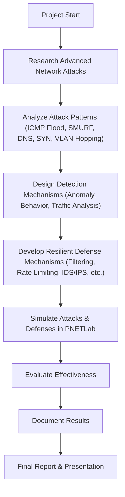

# Securing Networks: Advanced Attack Detection and Resilient Defense Mechanism

A B.Sc. Graduation Project — University of Baghdad, College of Science, Computer Science Department

---

## Abstract
Securing networks against advanced attacks has become a critical challenge in today’s digital landscape. This research project addresses this challenge by focusing on advanced attack detection and the development of resilient defense mechanisms. The objective is to enhance network security by identifying and mitigating sophisticated attack vectors, such as:

- **ICMP Flood Attacks**
- **SMURF Attacks**
- **DNS Attacks**
- **SYN Attacks**
- **VLAN Hopping Attacks**

The project involves comprehensive analysis of these attack patterns to understand their characteristics and potential impact on network infrastructure. Using advanced detection techniques—such as anomaly detection, behavior analysis, and network traffic analysis—effective mechanisms are developed to detect and identify these attacks in real-time. Resilient defense mechanisms are also devised to minimize the impact of successful attacks and ensure network availability and integrity.

---

## Features
- **Realistic Network Simulation** using [PNETLab](https://pnetlab.com/) and VMware
- **Attack Scenarios**: ICMP Flood, SMURF, DNS, SYN, VLAN Hopping
- **Detection Techniques**: Anomaly detection, behavior analysis, traffic analysis
- **Defense Mechanisms**: Traffic filtering, rate limiting, IDS/IPS, adaptive routing, load balancing, encryption, adaptive response
- **Comprehensive Documentation** (see [Documitation/Zahraa_Ibrahim_FinalProject.pdf](Documitation/Zahraa_Ibrahim_FinalProject.pdf))

---

## Technologies & Tools
- **PNETLab**: For network topology design and simulation
- **Kali Linux**: For attack simulation and penetration testing
- **VMware**: For running virtual machines (Kali Linux, Windows, etc.)
- **Cisco Routers/Switches** (simulated)
- **IDS/IPS Tools** (e.g., Snort, Suricata)

---

## Project Workflow

---

## Simulation Setup
1. **Requirements**
   - PNETLab installed (see [PNETLab documentation](https://pnetlab.com/))
   - VMware Workstation/Player
   - Kali Linux VM image
   - Windows 10 VM image (optional)
2. **Import the Lab**
   - Open PNETLab
   - Import the lab file: `Lab/_Exports_pnetlab_export-20240516-001351/Securing Networks_ Advanced Attack Detection and Resilient Defense Mechanism.unl`
3. **Start the Simulation**
   - Launch all nodes (routers, switches, VMs)
   - Configure interfaces as per the lab topology
   - Use Kali Linux to launch attacks and observe detection/defense mechanisms
4. **Analyze Results**
   - Monitor network traffic and logs
   - Evaluate the effectiveness of detection and defense strategies

---

## Documentation
- **Final Report**: [Documitation/Zahraa_Ibrahim_FinalProject.pdf](Documitation/Zahraa_Ibrahim_FinalProject.pdf)
- **PNETLab Lab File**: [Lab/_Exports_pnetlab_export-20240516-001351/Securing Networks_ Advanced Attack Detection and Resilient Defense Mechanism.unl](Lab/_Exports_pnetlab_export-20240516-001351/Securing%20Networks_%20Advanced%20Attack%20Detection%20and%20Resilient%20Defense%20Mechanism.unl)

---

## Author
**Zahraa Ibrahim**

B.Sc. in Computer Science, University of Baghdad, College of Science

---

## Acknowledgments
- University of Baghdad, College of Science, Computer Science Department
- PNETLab and open-source security communities

---

## License
This project is licensed under the [MIT License](LICENSE).
